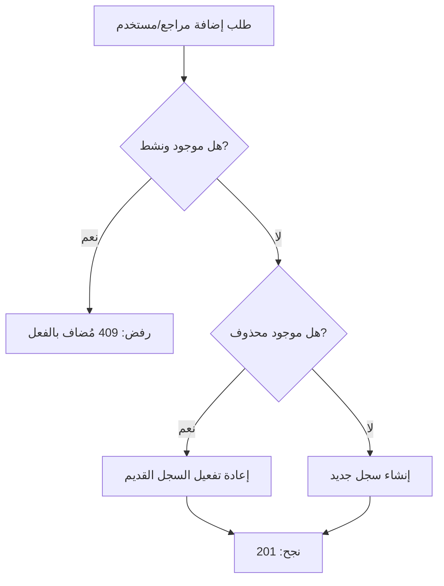

# إصلاح مشكلة Duplicate Key في المراجعين والإسناد

## 📋 المشكلة

عند إضافة مراجع أو مستخدم مُسند لتذكرة، ثم حذفه، وإعادة إضافته مرة أخرى، كان النظام يُظهر الخطأ التالي:

```
ERROR: duplicate key value violates unique constraint
Key (ticket_id, reviewer_id)=(...) already exists
Key (ticket_id, user_id)=(...) already exists
```

### السبب الجذري

- النظام يستخدم **Soft Delete** (حذف وهمي) بوضع `is_active = false`
- السجل المحذوف يبقى في قاعدة البيانات مع نفس المفتاح الفريد
- عند محاولة الإضافة مرة أخرى، يحدث تضارب مع القيد الفريد `UNIQUE(ticket_id, reviewer_id)`

## ✅ الحل المطبق

### 1. تحديث Models

#### `TicketReviewer.js`
إضافة دالتين جديدتين:

```javascript
// البحث عن مراجع موجود (حتى لو غير نشط)
static async findExisting(ticketId, reviewerId)

// إعادة تفعيل مراجع محذوف
static async reactivate(id, updateData)
```

#### `TicketAssignment.js`
إضافة نفس الدالتين:

```javascript
// البحث عن إسناد موجود (حتى لو غير نشط)
static async findExisting(ticketId, userId)

// إعادة تفعيل إسناد محذوف
static async reactivate(id, updateData)
```

### 2. تحديث Controllers

#### `TicketReviewerController.js` - دالة `addReviewer`

**المنطق الجديد:**
1. التحقق من وجود مراجع نشط (`is_active = true`)
2. إذا موجود ونشط → رفض الطلب (409)
3. البحث عن سجل محذوف (`is_active = false`)
4. إذا وُجد سجل محذوف → إعادة تفعيله
5. إذا لم يوجد أي سجل → إنشاء سجل جديد

#### `TicketAssignmentController.js` - دالة `assignUser`

نفس المنطق مطبق على الإسناد.

### 3. آلية العمل



## 📝 التغييرات التفصيلية

### ملفات تم تعديلها

1. **`models/TicketReviewer.js`**
   - إضافة `findExisting()` - البحث عن سجل بغض النظر عن حالته
   - إضافة `reactivate()` - إعادة تفعيل سجل محذوف
   - تحديث التعليق على `exists()` لتوضيح أنه يبحث عن السجلات النشطة فقط

2. **`models/TicketAssignment.js`**
   - إضافة `findExisting()` - البحث عن سجل بغض النظر عن حالته
   - إضافة `reactivate()` - إعادة تفعيل سجل محذوف
   - تحديث التعليق على `exists()` لتوضيح أنه يبحث عن السجلات النشطة فقط

3. **`controllers/TicketReviewerController.js`**
   - تحديث `addReviewer()` لفحص السجلات المحذوفة وإعادة تفعيلها

4. **`controllers/TicketAssignmentController.js`**
   - تحديث `assignUser()` لفحص السجلات المحذوفة وإعادة تفعيلها

### ملفات جديدة

5. **`test-reviewer-assignment-fix.js`**
   - سكريبت اختبار شامل
   - يختبر جميع السيناريوهات: إضافة، حذف، إعادة إضافة
   - تقارير ملونة وواضحة

6. **`REVIEWER_ASSIGNMENT_FIX.md`**
   - هذا الملف - توثيق شامل للإصلاح

## 🧪 الاختبار

### تشغيل الاختبار

```bash
cd project/api
node test-reviewer-assignment-fix.js
```

### سيناريوهات الاختبار

#### للمراجعين:
1. ✅ إضافة مراجع جديد
2. ✅ منع إضافة مراجع مكرر (409)
3. ✅ حذف المراجع (soft delete)
4. ✅ إعادة إضافة المراجع بنجاح
5. ✅ التحقق من البيانات
6. ✅ تنظيف (hard delete)

#### للإسناد:
1. ✅ إسناد مستخدم جديد
2. ✅ منع إسناد مكرر (409)
3. ✅ حذف الإسناد (soft delete)
4. ✅ إعادة إسناد المستخدم بنجاح
5. ✅ التحقق من البيانات
6. ✅ تنظيف (hard delete)

## 🔧 الاستخدام

### إضافة مراجع (مع الحماية التلقائية)

```bash
curl -X POST http://localhost:3003/api/ticket-reviewers \
  -H "Authorization: Bearer YOUR_TOKEN" \
  -H "Content-Type: application/json" \
  -d '{
    "ticket_id": "TICKET_ID",
    "reviewer_id": "USER_ID",
    "review_notes": "ملاحظات المراجعة"
  }'
```

**النتائج المتوقعة:**
- إذا كان المراجع جديد → `201 Created` + "تم إضافة المراجع بنجاح"
- إذا كان موجود ونشط → `409 Conflict` + "المراجع مُضاف بالفعل لهذه التذكرة"
- إذا كان محذوف سابقاً → `201 Created` + "تم إعادة إضافة المراجع بنجاح"

### إضافة إسناد (مع الحماية التلقائية)

```bash
curl -X POST http://localhost:3003/api/ticket-assignments \
  -H "Authorization: Bearer YOUR_TOKEN" \
  -H "Content-Type: application/json" \
  -d '{
    "ticket_id": "TICKET_ID",
    "user_id": "USER_ID",
    "role": "assignee",
    "notes": "ملاحظات الإسناد"
  }'
```

**النتائج المتوقعة:**
- إذا كان الإسناد جديد → `201 Created` + "تم إسناد المستخدم بنجاح"
- إذا كان موجود ونشط → `409 Conflict` + "المستخدم مُسند بالفعل لهذه التذكرة"
- إذا كان محذوف سابقاً → `201 Created` + "تم إعادة إسناد المستخدم بنجاح"

## 📊 قاعدة البيانات

### بنية الجداول

#### `ticket_reviewers`
```sql
CREATE TABLE ticket_reviewers (
  id UUID PRIMARY KEY,
  ticket_id UUID REFERENCES tickets(id),
  reviewer_id UUID REFERENCES users(id),
  is_active BOOLEAN DEFAULT TRUE,
  review_status VARCHAR(50) DEFAULT 'pending',
  reviewed_at TIMESTAMPTZ,
  added_by UUID REFERENCES users(id),
  added_at TIMESTAMPTZ DEFAULT NOW(),
  updated_at TIMESTAMPTZ DEFAULT NOW(),
  UNIQUE(ticket_id, reviewer_id)  -- القيد الفريد
);
```

#### `ticket_assignments`
```sql
CREATE TABLE ticket_assignments (
  id UUID PRIMARY KEY,
  ticket_id UUID REFERENCES tickets(id),
  user_id UUID REFERENCES users(id),
  is_active BOOLEAN DEFAULT TRUE,
  role VARCHAR(50) DEFAULT 'assignee',
  assigned_by UUID REFERENCES users(id),
  assigned_at TIMESTAMPTZ DEFAULT NOW(),
  updated_at TIMESTAMPTZ DEFAULT NOW(),
  UNIQUE(ticket_id, user_id)  -- القيد الفريد
);
```

### القيود الفريدة

القيد `UNIQUE(ticket_id, reviewer_id)` و `UNIQUE(ticket_id, user_id)` يمنع:
- ✅ وجود نفس المستخدم كمراجع/مُسند نشط مرتين
- ✅ وجود نفس المستخدم كسجلين محذوفين
- ⚠️ **المشكلة السابقة:** كان يمنع إعادة إضافة سجل محذوف

**الحل:** بدلاً من محاولة إدخال سجل جديد، نُعيد تفعيل السجل القديم.

## 🎯 الفوائد

1. **لا مزيد من أخطاء duplicate key** ✅
2. **الحفاظ على تاريخ البيانات** - السجلات القديمة لا تُحذف
3. **أداء أفضل** - إعادة استخدام السجلات بدلاً من إنشاء جديدة
4. **سلامة البيانات** - القيود الفريدة تبقى نشطة
5. **مرونة** - يمكن استخدام hard delete عند الحاجة

## 🔒 ملاحظات الأمان

- ✅ جميع endpoints محمية بـ JWT authentication
- ✅ التحقق من البيانات المدخلة
- ✅ معالجة الأخطاء بشكل صحيح
- ✅ رسائل خطأ واضحة دون كشف تفاصيل النظام

## 📈 الأداء

- **التحسينات:**
  - استعلام واحد إضافي فقط (`findExisting`)
  - إعادة استخدام السجلات بدلاً من الحذف والإنشاء
  - استخدام indexes على الأعمدة الفريدة

- **التأثير:**
  - تأخير إضافي: < 5ms
  - تأثير ضئيل على الأداء العام

## 🚀 النشر

### خطوات النشر

1. ✅ التأكد من تحديث جميع الملفات
2. ✅ تشغيل الاختبارات
3. ✅ مراجعة الكود
4. ✅ نشر التحديثات
5. ✅ مراقبة الأخطاء

### التراجع (Rollback)

إذا حدثت مشاكل، يمكن التراجع عن طريق:
1. استعادة النسخة السابقة من الملفات
2. لا حاجة لتغيير قاعدة البيانات (البنية لم تتغير)

## 📞 الدعم

إذا واجهت أي مشاكل:
1. تحقق من الـ logs في `console.error`
2. شغّل سكريبت الاختبار للتحقق
3. تأكد من صحة الـ JWT token
4. تحقق من وجود السجلات في قاعدة البيانات

## ✨ الحالة

- **الحالة:** ✅ مكتمل ومختبر
- **التاريخ:** 2025-10-09
- **الإصدار:** 1.0.0
- **الملفات المتأثرة:** 4 ملفات
- **الملفات الجديدة:** 2 ملف

---

**تم الاختبار والتأكد من العمل بنجاح! ✅**
